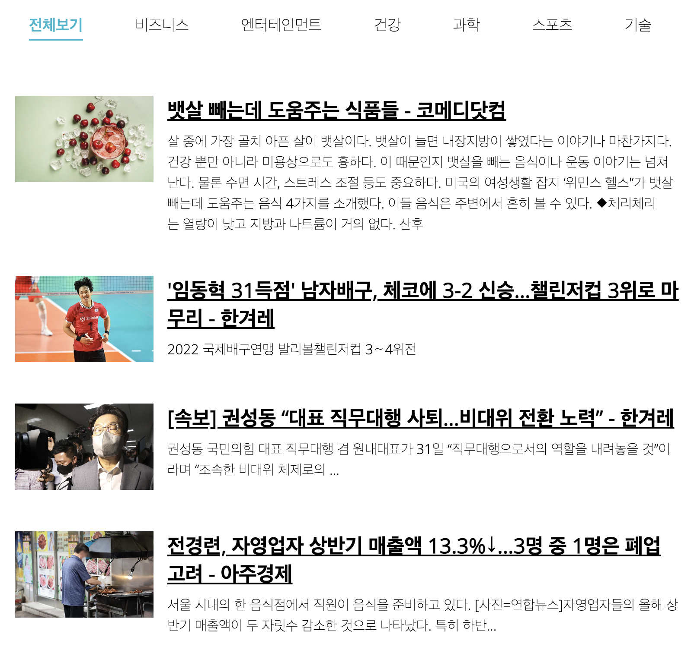

# Newslatter vanilla JS

  https://zerosial.github.io/newslatter/
   
   
  
   

## 프로젝트 소개

 바닐라 Js를 비동기 통신과 더불어 무한 스크롤 , 프록시의 사용법을 익힌다.
 또한 함수형 프로그래밍과 컴포넌트화에 신경써서 제작한다.

    

 

## 기술 스택

|  Html   |  Css   | JavaScript |
| :-----: | :----: | :--------: |
| ![html] | ![css] |   ![js]    |

 

## 구현 기능

### 프록시 서버를 통하여 전역객체 조절

기사를 만드는 getArticle을 프록시화 해서 호출 및 관리

### IntersectionObserver API를 통한 무한 스크롤 구현

최하단 SVG파일과 사용자의 뷰포트가 100% 겹칠 경우 다음 기사를 5개 추가로 불러와 로드함

### 컴포넌트화 (함수형 프로그래밍)

예전 리액트 클론 사이트를 제작할때 처럼 함수화하여 각 컴포넌트를 갱신 및 로드에 사용함

### Axios 를 사용한 Api 호출 및 데이터 표현

Es6 문법인 Asyne / Await 와 더불어 비동기 통신 라이브러리인 Axios를 사용하여 서버간 데이터 통신울 구현

 

## 배운 점 & 아쉬운 점

 꼭 리액트가 아니더라도 함수형으로 컴포넌트를 나눠 관리하면 코드가 깔끔해짐을 느꼇다.
 또한 리엑트환경이 아닌 순수 Js환경으로 Api 통신을 해 볼수 있어서 좋았다.

단 최근 NewsApi가 로컬에서의 호출만 허용하게 바뀌어 깃허브 페이지로 개시하는게 어려워져서 아쉽다.

 

## 라이센스

<!-- Stack Icon Refernces -->

[js]: /images/stack/javascript.svg
[css]: /images/stack/css.svg
[html]: /images/stack/html.svg
